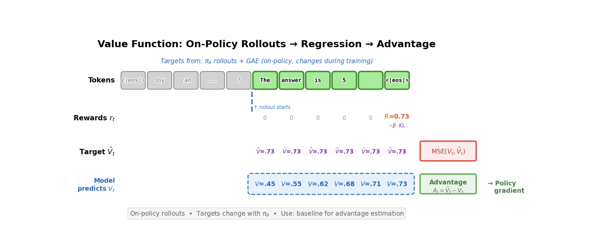

# Week 2 — Feb 20: RL Fundamentals & Policy Gradients

**UCLA ECE RLHF Reading Group**

**Chapters:** 6 (Fundamentals) | **Presenter:** TBD

*Note: Content, figures, and examples in these notes are drawn from Nathan Lambert's [RLHF Book](https://rlhfbook.com) and referenced papers. These are reading group notes, not original work.*

---

## Understanding RL Basics in the LLM/RLHF Context

### The simplified LLM bandit setting

Standard RL involves **state transitions**: agent takes action in state → environment transitions to new state → repeat. LLMs turn this into a **bandit problem** (single-step decision):

| Component | Standard RL | LLM RLHF |
|-----------|------------|---------|
| **State** | Current game/environment state | Prompt/instruction (fixed) |
| **Action** | Single move | Generated completion/response |
| **Reward** | From environment | From reward model (or verifiable signal) |
| **Trajectory** | Sequence of state-action pairs over time | Single prompt → completion pair |

### What is a "reward" in RLHF?

- **Not inherent to the problem** — unlike Atari (score) or robotics (reaching a goal), there's no ground truth reward for "good text"
- **Learned from human judgment** — the reward model $r_\theta(x, y)$ learns to predict: "Would a human prefer response $y$ to the prompt $x$?"
- **Sparse and relative** — humans compare pairs ("A better than B"), not absolute scores. The RM must infer absolute quality from these comparisons
- **Subject to misalignment** — the RM is a proxy for human preferences. It can overfit to noisy data, learn spurious patterns, and optimize tricks that don't reflect true human judgment (reward hacking/overoptimization)

### What is a "state" and "action" for an LLM?

- **State:** The prompt $x$ (also called context or instruction). Fixed at the start of the episode — doesn't change during the response generation
- **Action space:** The vocabulary — each token $y_t$ at position $t$ is an action. Technically infinite, but in practice we generate one sequence $y = [y_1, y_2, \ldots, y_T]$ of variable length
- **Policy:** The LLM's probability distribution over next tokens, $\pi(y_t | x, y_{<t})$ (autoregressive). The parameters $\theta$ are what we're optimizing
- **Implication:** This is why RLHF is cheap(er) than RL on state-space games — no state transitions to compute, just forward passes through a language model

---

## Introduction to Policy Gradients

### The core insight: maximize expected reward by following the gradient

The goal: maximize expected reward over trajectories from the policy
$$J(\pi_\theta) = \mathbb{E}_{y \sim \pi_\theta(y|x)}[r(x, y)]$$

We want to adjust the policy parameters $\theta$ to increase this objective. The **policy gradient theorem** tells us the gradient direction:

$$\nabla_\theta J(\pi_\theta) = \mathbb{E}[r(x, y) \cdot \nabla_\theta \log \pi_\theta(y|x)]$$

**Key insight:** The gradient pulls the policy toward high-reward actions and away from low-reward ones. We can estimate this gradient by:

1. Sample completions $y$ from the current policy
2. Score each with the reward model $r(x, y)$
3. Update:
$$\theta \leftarrow \theta + \alpha \cdot r(x, y) \cdot \nabla_\theta \log \pi_\theta(y|x)$$

### Why this works (and why it's noisy)

The policy gradient uses the **likelihood ratio trick** — we can express rewards in terms of log-probabilities without needing the reward function's gradient:

$$\nabla_\theta \mathbb{E}[r(x, y)] = \mathbb{E}[\nabla_\theta \log \pi_\theta(y|x) \cdot r(x, y)]$$

This is powerful because:
- We don't need $\nabla_\theta r(\cdot)$ (the RM might not be differentiable w.r.t. policy parameters)
- We only need samples from the policy and reward scores

But it's **high-variance**:
- A single reward signal tells us "this action was good/bad" but doesn't tell us *why*
- Rewards are noisy (RM is imperfect)
- Different samples have very different rewards, leading to unstable gradients

---

## Tricks to Reduce Bias and Variance: Advantage Functions

### The problem: pure reward has high variance

If we use raw reward $r(x, y)$ as the gradient weight, we're saying "apply the same weight to all tokens in the response." But not all tokens are equally important — some tokens generated the good part, others were neutral.

Also, if reward is always positive (e.g., 0.5 to 1.0), we push every token upward equally, wasting gradient signal on actions that didn't matter.

### Solution 1: Baseline subtraction (reduce variance, no bias)

Use a **baseline** $b(x)$ — typically the value function $V(x)$ — to center rewards:

$$A(x, y) = r(x, y) - V(x)$$

**Effect:**
- Actions with reward above average get positive gradient weight (increase probability)
- Actions with reward below average get negative weight (decrease probability)
- Neutral actions near the baseline stay near zero (no wasted gradient)

**Why it works:** Mathematically, subtracting a baseline doesn't change the gradient in expectation (it's zero-mean), but it drastically reduces variance — the **advantage** $A$ concentrates the signal on genuinely good vs. bad actions.

### Solution 2: Per-token advantages (decompose the trajectory)

The response $y = [y_1, \ldots, y_T]$ is a sequence. A single end-of-sequence reward $r(x, y)$ assigns credit to the entire trajectory, but we want to know which tokens deserve credit.

**Approach:** Use **temporal advantage decomposition** — compute advantages that account for the model's prediction at each step:

- At position $t$: what's the advantage of having generated token $y_t$ given the previous context?
- Use the reference model's log-probability at each token as a baseline

This is **more granular** than a single reward signal — it tells the policy which specific tokens were good moves.

### Solution 3: Advantage estimation from value functions (bootstrapping)

If we train a separate value function $V_\phi(x)$ to predict expected reward, we can estimate advantages more efficiently:

$$A(x, y) = r(x, y) - V_\phi(x)$$

or **temporal advantages:**

$$A_t = r_t + \gamma V_\phi(s_{t+1}) - V_\phi(s_t)$$

**Benefit:** We can use bootstrapping — future rewards are estimated from the value function rather than waiting for the whole trajectory to finish. This reduces variance even more.



---

## The Simplest Policy Gradient Algorithm: REINFORCE

### Algorithm

REINFORCE is the baseline policy gradient algorithm. It's simple enough to fit on a slide but captures the essential idea:

1. **Collect trajectory:** Sample completion $y$ from policy:
   $$y \sim \pi_\theta(\cdot | x)$$

2. **Compute return:** Get reward from RM:
   $$R = r(x, y)$$

3. **Compute gradient:** For each token position $t$ in the trajectory:
   $$g_t = \nabla_\theta \log \pi_\theta(y_t | x, y_{<t}) \cdot R$$

4. **Update policy:** Accumulate gradients and apply SGD:
   $$\theta \leftarrow \theta + \alpha \sum_t g_t$$

### Why it's noisy

- **Single reward for entire sequence:** One $R$ applies to all tokens, even neutral ones
- **High variance:** You need many samples to get a stable estimate of $\nabla J$
- **No bootstrapping:** You must wait for the full response before updating

### Why we still care (it's the foundation)

All modern policy gradient methods (PPO, GRPO, etc.) are refinements of REINFORCE that:
- Add advantage estimation to reduce variance
- Use multiple epochs on the same data (importance weighting)
- Add value function baselines
- Clip gradients to prevent catastrophic updates

But the core mechanism is always: sample from policy → score with reward → push gradient in reward direction.

### REINFORCE with baseline (the next step up)

Add a simple baseline $b(x)$ (often just the mean reward):

1. Sample:
   $$y \sim \pi_\theta(\cdot | x)$$

2. Get reward:
   $$R = r(x, y)$$

3. Compute advantage:
   $$A = R - b(x)$$

4. Update:
   $$\theta \leftarrow \theta + \alpha \nabla_\theta \log \pi_\theta(y|x) \cdot A$$

**Effect:** Rewards below the baseline now produce negative gradients, concentrating updates on truly good actions. Variance drops significantly.

---

## Key Equations to Know

**Policy gradient theorem:**
$$\nabla_\theta J(\pi_\theta) = \mathbb{E}_{\pi_\theta}[\nabla_\theta \log \pi_\theta(a|s) \cdot Q^\pi(s,a)]$$

**REINFORCE gradient (using empirical trajectory):**
$$g = \nabla_\theta \log \pi_\theta(y|x) \cdot r(x, y)$$

**Advantage-weighted gradient (with baseline):**
$$g = \nabla_\theta \log \pi_\theta(y|x) \cdot (r(x, y) - V(x))$$

**Why the baseline is unbiased:**
$$\mathbb{E}[V(x) \cdot \nabla_\theta \log \pi_\theta(y|x)] = V(x) \mathbb{E}[\nabla_\theta \log \pi_\theta(y|x)] = V(x) \cdot 0 = 0$$

---

## Discussion Questions

1. **State-action abstraction in LLMs:** We treat the prompt as a fixed "state" and token generation as the "action space." But in interactive settings, the prompt could evolve over time (like multi-turn dialogue). How does RLHF handle this? Does the policy gradient framework break?

2. **The reward model is the bottleneck:** RLHF's entire training loop depends on the reward model's quality. A bad RM leads to overoptimization and policy collapse. How should we think about RM uncertainty? Should we be training an ensemble and using disagreement as a signal for when to stop optimizing?

3. **Why does REINFORCE have such high variance?** Intuitively, a single reward for a 1000-token response seems like it should be enough information. What exactly is making the gradient estimates so noisy compared to supervised learning (SFT)?

4. **Advantage vs. reward scaling:** In REINFORCE with baseline, how sensitive is the training to how we compute $A = R - V(x)$? If $V$ is poorly trained, does the advantage estimate become worse than no baseline at all?

5. **On-policy data collection:** Policy gradients require sampling from the *current* policy. This means we can't reuse old data — we have to collect new rollouts every step. How much does this on-policy requirement hurt sample efficiency? When would an off-policy method (like DPO, Chapter 8) be preferable?

---

## Notes

- **Core intuition for policy gradients:** The policy gradient theorem says we can compute a gradient of expected reward using only samples from the policy and the *log-probability* of the policy (not the reward model's gradient). This is why policy gradients work for RL with a learned reward function — we're not trying to differentiate through the RM, just use its outputs as a training signal.

- **Log-probability tricks:** The update $\nabla_\theta \log \pi_\theta(y|x) \cdot r(x, y)$ is the "likelihood ratio trick." It works because $\nabla_\theta \log f(\theta) = \nabla_\theta f(\theta) / f(\theta)$, so taking the log-prob gradient "undoes" the probability in the expectation and lets us work with samples instead.

- **Why a baseline doesn't introduce bias:** This is a beautiful mathematical fact. Subtracting a state-dependent baseline $b(s)$ from the reward signal doesn't change the expected gradient — $\mathbb{E}_\pi[\nabla \log \pi \cdot b(s)] = 0$ always. So we get a variance reduction for *free* (in terms of bias). The catch: we need a good estimate of $b$ or we're subtracting noise, which hurts learning.

- **Variance catastrophe in RL:** Policy gradients are notoriously high-variance. A single scalar reward has to explain the entire trajectory. Compare to supervised learning where every token has a target — RL is much noisier. This is why techniques like importance weighting (PPO), reward normalization, and value functions are so important.

- **On-policy requirement:** Because the policy gradient theorem uses $\mathbb{E}_{\pi_\theta}[\cdots]$, we need samples from the *current* policy. If we reuse old data from an old policy, the mismatch (importance weights) explodes and causes instability. This is the key difference from off-policy methods like DPO and Q-learning.

- **Why LLM RLHF is cheaper than Atari RL:** Atari RL requires simulating the environment (state transitions), which is expensive. LLM RLHF skips this — you just sample from the policy (one forward pass, slow but no simulation), score with the RM (another forward pass, fast), and update. No environment simulation needed. This is a huge win for language models.

---

## Action Items

- [ ] Assign Ch 6 (full) presenter for Week 3
- [ ] Read Ch 6 (Policy Gradients) — focus on REINFORCE, RLOO, PPO sections
- [ ] Hands-on: explore the policy_gradients code structure:
  ```bash
  cd rlhf-book/code
  find policy_gradients -name "*.py" | head -20
  # Look at: loss.py (understand the loss classes), config.py (what hyperparams are tunable)
  ```
- [ ] Optional: read the policy gradient lecture from Sergey Levine's RL course (UC Berkeley CS285) for mathematical depth
- [ ] Next week: be ready to discuss RLOO, PPO, and GRPO — how they improve on REINFORCE
