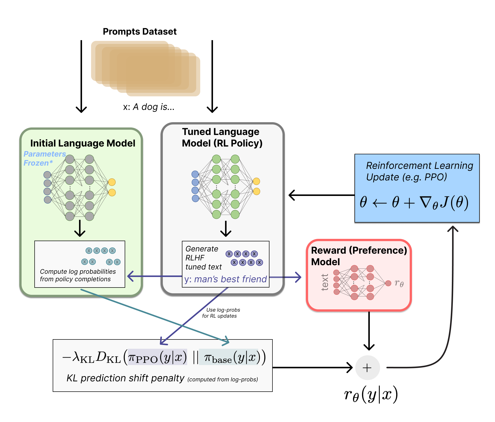
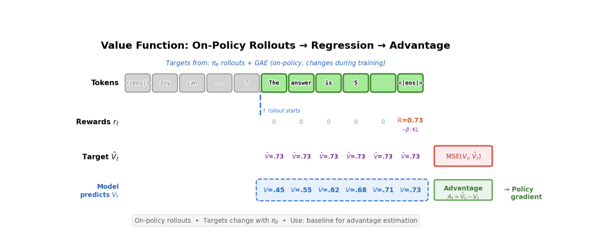

# Week 3 — Feb 26: Instruction Tuning & Reward Models

**UCLA ECE RLHF Reading Group**

**Chapters:** 4-5 | **Presenter:** Merve

*Note: Content, figures, and examples in these notes are drawn from Nathan Lambert's [RLHF Book](https://rlhfbook.com) and referenced papers. These are reading group notes, not original work.*

### Learning objectives

By the end of this session you should be able to:
1. Write RLHF as a contextual-bandit RL problem with a learned reward
2. Derive the Bradley-Terry preference objective and explain why it depends on score *differences*
3. Cleanly distinguish **BT RM vs ORM vs PRM vs Value Function** — what supervision each needs, what it outputs, and why "aggregation" shows up for some but not others
4. Know what goes wrong (distribution shift, reward hacking, style bias) and how people benchmark RMs

---

## Chapter 4: Instruction Fine-Tuning (IFT)

### What IFT does and why it comes first

Instruction fine-tuning (IFT), also called supervised fine-tuning (SFT), teaches a pretrained language model the **instruction-response format**. Without it, the model just continues text — it doesn't know to answer questions.

SFT is the prerequisite for everything downstream: preference data collection, reward model training, and RLHF all require a model that can follow instructions. You can't collect preference data if the model outputs incoherent garbage.

Two lines of work converged to make IFT happen:
1. NLP shifted from task-specific fine-tuning to unified instruction framing (T5, FLAN, T0)
2. Scaling pretrained LMs showed generalization improves dramatically when the model is explicitly trained on instruction-response examples

### Chat templates

All post-training stages rely on a structured format called the **chat template**. The model has special tokens:
- `<bos_token>` — beginning of sequence
- `<eos_token>` — end of sequence
- Padding token — for batched training

Messages are structured with three roles:

```
<|im_start|>system
You are a friendly chatbot who always responds in the style of a pirate<|im_end|>
<|im_start|>user
How many helicopters can a human eat in one sitting?<|im_end|>
<|im_start|>assistant
```

The model generates tokens until it produces `<|im_end|>`. This extends naturally to multi-turn conversations by alternating user/assistant blocks.

**How does the model learn to follow this protocol?** It doesn't inherently know — it learns it during SFT. All training data is formatted with the template, so after thousands of examples the model learns the pattern through next-token prediction. The special tokens (`<|im_start|>`, `<|im_end|>`) never appear in pretraining data, so they become very clean, unambiguous signals.

In practice, the template is Jinja2 code stored in the tokenizer and applied via `apply_chat_template`. Different models use different templates (ChatML, Zephyr, Tulu).

**Hierarchical system prompts:** OpenAI and other providers use a system where there's a hidden meta-prompt users can't see ("You are ChatGPT, made by OpenAI...") that takes priority over user-configured system prompts. If the user's system prompt conflicts with the hidden one (e.g., "ignore safety guidelines"), the hidden one wins.

### The autoregressive loss

SFT uses the **same loss function as pretraining** — next-token prediction via cross-entropy:

$$\mathcal{L} = -\sum_{t=1}^{T} \log \pi_\theta(y_t | y_{<t})$$

The key difference from pretraining is not the loss — it's the **data** and **masking**.

### Prompt masking

Prompt tokens are masked out during SFT:
- Only trains on assistant response tokens
- No wasting gradient signal learning to predict queries
- Teach good answers, not good questions

### Multi-turn masking

For multi-turn conversations, two common approaches:

1. **Final-turn only:** Only the last assistant response is in the loss. All prior context (including earlier assistant turns) is masked. Cleaner signal — one focused response per example.
2. **All assistant turns:** Every assistant turn is in the loss, user turns are masked. More data-efficient — every assistant response becomes a training signal.

No strong theoretical reason to prefer one — it's empirical. [Tulu 3](https://arxiv.org/abs/2411.15124) uses all-assistant-turns.

### Best practices

1. **High-quality completions are key** — the model learns from responses (prompts are masked)
2. **~1M prompts** is the practical sweet spot; diminishing returns beyond that
3. **Match prompt distribution** to downstream tasks of interest
4. **Don't over-optimize SFT** — if RLHF follows, the model can recover from some noise. Optimizing the overall pipeline matters more than perfecting each stage.
5. **Smaller batch sizes** than pretraining (e.g., OLMo 2: 1024 → 256 for 7B)
6. **Run multiple seeds** and pick the best — post-training is sensitive to randomness
7. **QLoRA** makes SFT accessible on consumer hardware for narrow domains

### Is IFT research saturated?

The algorithm is settled — it's just supervised learning. Active research is on **data curation**: what data to include, how much synthetic data, mixing ratios, quality filtering. Papers like [Tulu 3](https://arxiv.org/abs/2411.15124) and LIMA are about data, not new training methods. The frontier has moved from "how to train" to "what to train on."

---

## Chapter 5: Reward Models

### Where reward models fit in the pipeline



The canonical 3-stage RLHF recipe:

1. Base model → **SFT model** (trained on human demos/instructions)
2. SFT model + preference data → **Reward model** (learns to score responses)
3. Optimize the SFT/policy model against the reward model (e.g., PPO) → **aligned model**

The RM plays the role of the **environment's reward function** in standard RL — except in RLHF we *learn* it from humans instead of the environment giving it for free. It's a **proxy objective**: we optimize a proxy because the real objective ("be helpful, truthful, safe, follow user intent") is hard to write down as a loss function. The RM is where those hard-to-specify goals get turned into a learnable scalar.

Once trained, the reward model IS a function — plug in (prompt, response), get a scalar out. Labels are only needed for training, not inference.

### Historical context: alignment, IRL, and reward models

Reward models were originally proposed for studying the **value alignment problem** (Leike et al. 2018) — ensuring AI pursues goals aligned with human values. The core obstacle: good reward functions are hard to design because users often only have an *implicit* understanding of what they want.

RM training is closely related to **inverse reinforcement learning (IRL)**, but treated as a separate area in practice:

- **RL (forward):** given reward $r$, find a policy $\pi$ that maximizes it
- **IRL (inverse):** given expert trajectories, infer a reward $r$ that would make them optimal
- **RLHF RM training:** given human comparisons of outputs, learn a scoring function $r_\theta(x, y)$ that predicts what humans like

In LLM RLHF, it's a **bandit-style** setup (prompt → full completion → score), which differs from classic long-horizon trajectory IRL.

### The Bradley-Terry preference model

The canonical reward model implementation derives from the Bradley-Terry model. Given two completions, the probability one is preferred:

$$P(y_c \succ y_r | x) = \sigma(r_\theta(y_c | x) - r_\theta(y_r | x))$$

where $\sigma$ is the sigmoid function.

**Why sigmoid and unbounded scores?** We want the model to output unconstrained scores (any real number), but we need probabilities (0 to 1). The $e^{r_i}$ maps reals to positives, and the ratio gives a probability. This simplifies to the sigmoid of the difference. Key insight: only the **difference** between scores matters — adding a constant to all scores changes nothing.

The loss function (two equivalent forms):

$$\mathcal{L}(\theta) = -\log \sigma(r_\theta(y_c | x) - r_\theta(y_r | x))$$

$$\mathcal{L}(\theta) = \log(1 + \exp(r_\theta(y_r | x) - r_\theta(y_c | x)))$$

These are mathematically identical (rearranging $\sigma(x) = 1/(1+e^{-x})$). Form 2 is also known as **softplus**. Both appear in the literature because:
- Different papers/frameworks prefer different standard functions (`logsigmoid` vs `softplus`)
- One form may be more numerically stable depending on implementation
- Softplus is common in convex analysis derivations

### Architecture

Take a pretrained **causal language model** (left-to-right attention only, like GPT — as opposed to BERT which attends in both directions) and attach a **reward head** (linear layer `hidden_dim → 1`) on top of the backbone.

At inference: extract the hidden state at the last token position, project to a scalar through the reward head. That scalar is the reward.

```python
class BradleyTerryRewardModel(nn.Module):
    def __init__(self, base_lm):
        super().__init__()
        self.lm = base_lm
        self.head = nn.Linear(self.lm.config.hidden_size, 1)

    def forward(self, input_ids, attention_mask):
        outputs = self.lm(input_ids=input_ids, attention_mask=attention_mask,
                          output_hidden_states=True, return_dict=True)
        hidden = outputs.hidden_states[-1]
        # Get last token's hidden state
        lengths = attention_mask.sum(dim=1) - 1
        batch_idx = torch.arange(hidden.size(0), device=hidden.device)
        seq_repr = hidden[batch_idx, lengths]
        rewards = self.head(seq_repr).squeeze(-1)
        return rewards
```

This is similar to HuggingFace's `AutoModelForSequenceClassification`. Typically **all weights are trained** (full fine-tuning), not just the new head.

**Often 1 epoch (or very few) is used to avoid overfitting** — preference data is noisy (~25-30% annotator disagreement) and the label space is simple (binary), so extra epochs risk memorizing annotator quirks rather than learning general preferences. The exact choice is empirical.

### Variants

**Why binary preferences instead of ratings?** Pairwise comparison ("which is better?") is easier for labelers to do consistently and easier to model. Even when you *have* Likert ratings (1-5 scale), the common practice is to binarize into chosen/rejected. Rating differences are noisier because annotator calibration varies ("my 4 vs 2" ≠ "your 4 vs 2").

**Preference margin (Llama 2):** When annotators do provide Likert scores, use the margin between scores in the loss: $\mathcal{L} = -\log \sigma(r_c - r_r - m(y_c, y_r))$. Llama 3 dropped this — didn't help at scale. Likely because margins overweight inconsistent annotator calibration, and as models improve many comparisons become "close" so margin noise dominates.

**K-wise ranking (Plackett-Luce):** Generalize from pairs to full rankings of K completions. Reduces to Bradley-Terry when K=2. Helps with circular ranking issues (A>B, B>C, C>A) by seeing the full ordering at once. Note: BT *assumes* a global scalar latent utility exists, so it's inherently transitive — cycles in data are noise the model compromises on. This is an important "assumptions matter" point: if preferences are truly intransitive or context-dependent (e.g., multi-objective tradeoffs where helpfulness and safety conflict), you'd need a richer model (context-dependent reward, mixtures, etc.). The scalar utility assumption is convenient but nontrivial.

**Balancing multiple comparisons per prompt:** With K responses per prompt, form all $\binom{K}{2}$ pairs and weight the loss per comparison to balance the training signal.

### The four types of reward/value models

| Model | Predicts | Granularity | Loss | Architecture |
|-------|----------|-------------|------|-------------|
| **Preference RM** | Quality (chosen probability) | One score at EOS | `-log σ(r_c - r_r)` (BT loss) | `hidden_dim → 1` at last token |
| **ORM** | Per-token correctness | Every token | `BCEWithLogitsLoss` | `hidden_dim → 1` per token |
| **PRM** | Step validity | Per reasoning step | `CrossEntropyLoss` (3-way) | `hidden_dim → 3` at step boundaries |
| **Value Function** | Expected future reward | Per token | `MSELoss` (regression) | `hidden_dim → 1` per token |

**Two axes people mix up when comparing these models:**

*Axis A — Supervision granularity (what labels do you have?):*
- Preference RM: "A is better than B" (pairwise)
- ORM: correct/incorrect (outcome-level)
- PRM: this step is correct/incorrect/neutral (step-level)

*Axis B — Output granularity (where does the model produce scores?):*
- Preference RM: single scalar at EOS
- ORM: per-token predictions
- PRM: per-step predictions at step boundaries

So ORM can be more granular in *output frequency* (per token) while PRM is more granular in *label precision* (step-localized credit). These are different things.

Key distinctions:
- **ORM vs Value Function:** Both output per-token scalars, but ORM predicts "is this token in a correct response?" (static, trained on offline data). Value function predicts "what reward do I expect from here onward under the current policy?" (dynamic, retrained as the policy changes).
- **Aggregation:** Preference RMs output one scalar at EOS (no aggregation needed). ORMs and PRMs output scores at multiple positions and need aggregation (average, min, product) to get a single response-level score for use in RLHF.

### Outcome Reward Models (ORM) — deep dive

How per-token ORM training actually works:
1. Generate a response to a math problem
2. Check: is the final answer correct? Yes → label 1, No → label 0
3. That single label gets **broadcast to every token** in the response
4. Train with binary cross-entropy at each token position

**"But if the label is the same for every token, how does it learn anything per-token?"** The attention mechanism means each token's hidden state encodes different contextual information. Tokens near errors will have different hidden representations than tokens in correct parts. So the per-token predictions aren't identical — but they ARE noisy, because the supervision is coarse.

**What ORM is actually learning:** The per-token output is best understood as a **prefix-to-outcome predictor**: "given everything written so far, what's the probability the final answer will be correct?" It's not scoring the token "the" — it's scoring the *state* (the entire prefix up to that point). A prefix that already contains an arithmetic error should have lower success probability than a clean prefix. This is useful for reranking and early rejection of doomed trajectories, but it's **not true credit assignment** — fine output granularity without fine supervision granularity can't localize errors. That's exactly why PRMs exist.

```python
class OutcomeRewardModel(nn.Module):
    def __init__(self, base_lm):
        super().__init__()
        self.lm = base_lm
        self.head = nn.Linear(self.lm.config.hidden_size, 1)

    def forward(self, input_ids, attention_mask=None, labels=None):
        outputs = self.lm(input_ids=input_ids, attention_mask=attention_mask,
                          output_hidden_states=True, return_dict=True)
        hidden = outputs.hidden_states[-1]
        logits = self.head(hidden).squeeze(-1)  # per-token scores
        mask = labels != -100
        if mask.any():
            loss = F.binary_cross_entropy_with_logits(logits[mask], labels[mask].float())
        return loss, logits
```

Note: you're labeling **sampled trajectories**, not every possible token. Different rollouts of the same prompt get different labels depending on whether their final answer is correct.

### Process Reward Models (PRM) — deep dive

PRMs predict correctness at **step boundaries** (e.g., double newlines in chain-of-thought). Three-class output: correct (+1), neutral (0), incorrect (-1).

$$\mathcal{L}_{PRM} = -\mathbb{E}\left[\sum_{i=1}^{K} y_{s_i} \log r_\theta(s_i | x) + (1 - y_{s_i}) \log(1 - r_\theta(s_i | x))\right]$$

The key difference from ORM: each step gets its **own label**, not a broadcast from the final outcome.

```python
class ProcessRewardModel(nn.Module):
    def __init__(self, base_lm, num_classes=3):
        super().__init__()
        self.lm = base_lm
        self.head = nn.Linear(self.lm.config.hidden_size, num_classes)

    def forward(self, input_ids, attention_mask=None, labels=None):
        outputs = self.lm(input_ids=input_ids, attention_mask=attention_mask,
                          output_hidden_states=True, return_dict=True)
        hidden = outputs.hidden_states[-1]
        logits = self.head(hidden)  # per-token, 3-class
        mask = labels != -100
        if mask.any():
            loss = F.cross_entropy(logits[mask], labels[mask])
        return loss, logits
```

**Why PRMs help — concrete example:**

```
Math problem: "What is 15% of 80?"

Step 1: Convert 15% to decimal → 0.15     ✓ (PRM: correct)
Step 2: Multiply 0.15 × 80 → 1.2          ✗ (PRM: incorrect)
Step 3: The answer is 1.2                  ✗ (PRM: incorrect)
```

- **ORM:** Scores the whole thing low. Knows the answer is wrong but not *where*.
- **PRM:** Pinpoints Step 2 as the error. Step 1 was fine — don't penalize it.

**How PRMs get their labels:**

1. **Human annotation (PRM800K):** Annotators label each step as correct/incorrect/neutral. Expensive but high quality. Limited to domains where humans can verify steps.
2. **Monte Carlo estimation:** Instead of paying humans to label each step, you automate it. From each intermediate step, sample many completions (rollouts) to the end and check what fraction reach the correct final answer. The step's quality score ≈ completion success rate from that point.

   **Concrete example:**
   ```
   Math problem: "What is 15% of 80?"

   Step 1: Convert 15% to decimal → 0.15
     → Sample 100 completions from here → 92 reach correct answer
     → Step 1 score: 0.92 (good step)

   Step 2: Multiply 0.15 × 80 → 1.2  (wrong!)
     → Sample 100 completions from here → 3 reach correct answer
     → Step 2 score: 0.03 (bad step — almost nothing recovers from this error)
   ```
   Cheaper and scalable (only need a final answer checker, no human step labels), but noisier since you're estimating with finite samples.

### ORM vs PRM tradeoffs

| | ORM | PRM |
|---|-----|-----|
| **Supervision** | Final answer correctness | Per-step correctness |
| **Labeling cost** | Low (just check the answer) | High (annotators verify each step) |
| **Credit assignment** | Coarse (broadcast label) | Fine-grained (per-step label) |
| **Best for** | General tasks, preference learning | Math, code, structured reasoning |
| **Reward hacking risk** | Higher (model can get lucky) | Lower (each step is verified) |
| **Scales to** | Any domain | Domains with verifiable intermediate steps |

**When is each useful?**
- **ORMs** are great when correctness is verifiable (math/code) — you can get tons of labels cheaply by auto-grading final answers
- **PRMs** are great when you care about *how* the model reasons — you can pinpoint where it went wrong and reward human-endorsed reasoning steps

### The bigger picture: automated verification and RLAIF

The ORM vs PRM distinction points to a deeper trend: **the verification bottleneck**. As models get more capable, humans struggle to verify their outputs — a PhD mathematician can check a proof, but that doesn't scale. This is pushing the field from RLHF (human feedback) toward **RLAIF** (AI feedback). The pipeline is the same, the only difference is who provides the signal:

- **RLHF:** human labels → reward model → RL
- **RLAIF:** AI labels → reward model → RL (or the AI *is* the reward model)

PRMs are central to this shift. For verifying complex reasoning (e.g., mathematical proofs, multi-step code), you need step-level verification, not just "is the final answer right." A PRM that can check each reasoning step is essentially an automated verifier.

The progression: human verifiers (expensive, doesn't scale) → PRMs trained on human labels (PRM800K) → PRMs trained via Monte Carlo (no humans, just a final answer checker) → fully generative verifiers that reason about *why* a step is wrong. Each step removes more of the human bottleneck.

---

### Generative Reward Modeling (LLM-as-a-judge)

Instead of training a dedicated RM, prompt an existing LLM to judge responses — mirroring human annotation. Used in evaluations like AlpacaEval, Arena-Hard, WildBench.

**This is inference only — no training.** You prompt GPT-4 or Claude to compare two responses and pick the better one. Use temperature=0 for consistent scores (temperature > 0 gives different answers each time).

**Why it underperforms trained RMs:**
- Trained RMs learn a dedicated internal representation optimized end-to-end for quality assessment
- LLM judges have **calibration issues** — they're not trained to be consistent scalar evaluators
- **Prompt sensitivity** and hidden biases: position bias (prefer first response), verbosity bias (prefer longer), self-bias (prefer their own style)
- **Distribution mismatch** between the judge prompt format and how dedicated RMs are trained/evaluated
- No fine-tuning specifically for reward prediction

But the gap is closing as frontier models improve. Active research area.

### Why benchmark reward models?

The RM is an instrument in a bigger pipeline, and picking the "best RM" by intuition is unreliable. The gold standard (run full RLHF and check downstream performance) is too expensive. Benchmarks are cheaper proxies. See Frick et al. (ICLR 2025), "How to Evaluate Reward Models for RLHF," which argues for proxy evaluations that predict downstream RLHF outcomes.

### Current state of the field

Reward modeling research is very active, with many benchmarks emerging in 2024-2025:

**Preference RM benchmarks:**
- [RewardBench](https://arxiv.org/abs/2403.13787) (2024) — broad benchmark of prompt/chosen/rejected trios
- [RM-Bench](https://arxiv.org/abs/2410.16184) (2024) — targets subtle content differences + robustness to style bias
- [reWordBench](https://ai.meta.com/research/publications/rewordbench-benchmarking-and-improving-the-robustness-of-reward-models-with-transformed-inputs/) (2025, Meta) — tests robustness under meaning/ranking-preserving input transforms
- [RewardBench 2](https://arxiv.org/abs/2506.01937) (2025) — harder data, stronger correlation to downstream PPO / best-of-N
- Frick et al. (ICLR 2025), ["How to Evaluate Reward Models for RLHF"](https://openreview.net/pdf?id=cbttLtO94Q) — argues for proxy evaluations that predict downstream RLHF outcomes

**PRM / step-level benchmarks:**
- [ProcessBench](https://arxiv.org/abs/2412.06559) (2024) — measures ability to identify erroneous steps in math reasoning
- [PRMBench](https://arxiv.org/abs/2501.03124) (2025) — fine-grained PRM error detection beyond "step correctness"

**Surveys:**
- "A Survey of Process Reward Models" (2025) covers the broader PRM landscape

---

## Week 2 Revisited: RL Concepts with Reward Model Context

*Now that we understand what reward models are and the different types (Preference RM, ORM, PRM), let's revisit last week's RL concepts. The confusion about value functions and advantages makes more sense when you know what the reward signal actually looks like.*

### The thing RL optimizes against

The policy gradient methods from Week 2 use the reward model's output as their training signal. The quality of that signal — how granular, how accurate, how noisy — directly determines how well RL training works. This is why we covered reward models first (as the book intended).

### Two framings: bandit vs. token MDP

Different algorithms treat the problem at different levels:

**Framing 1: Bandit (response-level) — REINFORCE, GRPO**
- Full response $y$ is one "action"
- One reward $r(x, y)$ for the whole thing
- $Q(x, y) = r(x, y)$ — Q is just the reward, no estimation needed
- Simple but crude: no credit assignment to individual tokens

**Framing 2: Token MDP (token-level) — PPO**
- Each token $y_t$ is an action
- State at time $t$ = prompt + tokens so far: $s_t = (x, y_1, \ldots, y_{t-1})$
- Reward is **sparse**: $r_t = 0$ for all tokens except the last, where $r_T = R$
- A value model $V_\phi(s_t)$ predicts expected reward from each intermediate state

### Why do we need both a value model and a policy?

- **Policy $\pi_\theta$**: the LLM itself. Generates text. This is what we're training.
- **Value function $V_\phi$**: a training helper that estimates expected reward for a given state. Exists only to reduce variance in policy training.

You *can* drop $V$ entirely — that's REINFORCE (use raw rewards) or GRPO (use mean reward across samples as baseline). The value model is an **optimization trick**, not a requirement.

### Why V instead of Q?

- **Q for the action you took** → you already observe it directly. It's the return (reward) from the rollout.
- **V (average across all possible actions)** → you can't observe this from a single rollout. V(s_t) = sum over all actions of pi(a\|s_t) * Q(s_t, a) — it's an expectation over the whole vocabulary. So you estimate it with a small learned model (`hidden_dim → 1`).

You don't need Q for all 32K+ vocabulary tokens — you only need it for the one you actually generated, and you already have that from the reward model.

### The diagram from the book explained



Walking through the figure (page 60):

**Rewards $r_t$:** All zeros until `<eos>`, then $R = 0.73$. The reward model only scores the completed response.

**Target $\hat{V}_t = 0.73$ for all tokens:** No intermediate rewards, no discounting, so the return from every position is the final reward.

**Model predicts $V_t$: 0.45 → 0.55 → 0.62 → 0.68 → 0.71 → 0.73:** Early on the value model is uncertain; as more tokens reveal the answer, confidence grows.

**Advantage = Target - Predicted:**

| Token | Target V | Predicted V | Advantage |
|-------|----------|-------------|-----------|
| "The" | 0.73 | 0.45 | **+0.28** |
| "answer" | 0.73 | 0.55 | **+0.18** |
| "is" | 0.73 | 0.62 | **+0.11** |
| "5" | 0.73 | 0.68 | **+0.05** |
| `<eos>` | 0.73 | 0.73 | **~0** |

This is **credit assignment**. Early tokens that "committed" to the right answer get large advantages — the value model didn't expect things to go this well. Later tokens get less credit because success was already expected.

The value model is trained via **MSE regression** against the actual return.

### Why subtracting V reduces variance

REINFORCE gradient:

$$g = \nabla_\theta \log \pi_\theta(y \mid x) \cdot r(x, y)$$

If rewards are always between 0.7 and 1.0, every response gets a positive weight. The gradient pushes everything up.

With baseline:

$$g = \nabla_\theta \log \pi_\theta(y \mid x) \cdot (r(x, y) - V(x))$$

Now good responses get positive weight, bad ones get negative weight. The gradient concentrates on the **relative** signal.

**Why this is unbiased:** The expected value of the baseline term is zero because of the score function identity — the expected gradient of log-probability under its own distribution is always zero. Subtracting any baseline is free: zero bias, reduced variance.

### Connecting it all: denser rewards help RL

| Reward type | Supervision | Credit assignment | Algorithms |
|-------------|-------------|-------------------|------------|
| **Preference RM** | End of sequence (scalar at EOS) | Coarse (needs V baseline) | REINFORCE, PPO, GRPO |
| **ORM** | Outcome-level, but may output per-token | Coarse (broadcast label) | REINFORCE, PPO, GRPO |
| **PRM** | Per reasoning step | Fine-grained | Better advantages, less noise |
| **Per-token** | Every token | Maximum | Dense rewards make TD-style ideas more plausible, but action space + off-policy instability make it very hard in practice |

This is the core insight connecting Chapters 5 and 6: the **quality of the reward signal** determines how well RL training works. PRMs give better signal → RL converges faster → less reward hacking. Useful analogy (not equivalence): Monte Carlo PRM training resembles empirical Q-estimation — sample many continuations from each step and check success rates.

---

## Key Equations to Know

**Autoregressive loss (pretraining and SFT):**
$$\mathcal{L} = -\sum_{t=1}^{T} \log \pi_\theta(y_t | y_{<t})$$

**Bradley-Terry preference probability:**
$$P(y_c \succ y_r | x) = \sigma(r_\theta(y_c | x) - r_\theta(y_r | x))$$

**Reward model loss:**
$$\mathcal{L}(\theta) = -\log \sigma(r_\theta(y_c | x) - r_\theta(y_r | x))$$

**ORM loss (per-token binary cross-entropy):**
$$\mathcal{L}_{CE} = -\mathbb{E}_{(s,r) \sim D}[r \log p_\theta(s) + (1-r) \log(1-p_\theta(s))]$$

**PRM loss (per-step cross-entropy):**
$$\mathcal{L}_{PRM} = -\mathbb{E}\left[\sum_{i=1}^{K} y_{s_i} \log r_\theta(s_i | x) + (1 - y_{s_i}) \log(1 - r_\theta(s_i | x))\right]$$

**Advantage (variance reduction):**
$$A(x, y) = r(x, y) - V(x)$$

---

## Discussion Questions

1. **The reward model learns from human preferences, but humans disagree ~25-30% of the time.** What does this noise ceiling mean for RM quality? Can an RM be "better than human annotators" by averaging out disagreement, or is it fundamentally limited by annotation quality?

2. **ORM per-token outputs can be interpreted as prefix-to-outcome prediction** — P(success | prefix so far). But the supervision is still a single broadcast label. What evidence do we have that per-token ORM improves anything beyond just scoring at EOS? Is this "prefix progress meter" genuinely useful, or is it noise?

3. **PRM step boundaries are defined by formatting (double newlines).** But what defines a "step" for code? For general reasoning? How sensitive is PRM quality to step boundary definition?

4. **The PRM ≈ Q-function connection.** Monte Carlo PRM training estimates Q by sampling completions from each step. If a PRM is a learned Q-function, could we use it directly in Q-learning instead of policy gradients?

5. **Generative RMs (LLM-as-judge) currently underperform trained RMs.** But frontier models keep improving. Is there a crossover point where prompting a strong model beats training a dedicated RM? What are the economics?

6. **All RM training methods we covered are supervised (BCE, cross-entropy, BT loss).** Why not use RL to train the reward model itself? Where would it make sense to move from supervised to RL-based RM training, and what challenges would that introduce?

---

## Notes

- **Why the book orders things SFT → RM → RL:** Each piece builds on the previous. SFT gives you a model that follows instructions. The RM learns to score that model's outputs. RL optimizes the model against the RM. Our reading group covered RL (Ch 6) before RM (Ch 5), which caused confusion — the value function and advantage concepts make more sense once you understand where the reward signal comes from.

- **Reward models learn relative quality, not absolute.** The Bradley-Terry loss only depends on score differences. A model that outputs (5.0 for chosen, 3.0 for rejected) and one that outputs (105.0, 103.0) produce identical losses. This is why you can't interpret raw reward scores as "quality" — only the ranking matters.

- **IFT is solved algorithmically but not solved for data.** The training procedure is just supervised learning with masking. All the innovation is in data: what to include, quality filtering, synthetic generation, mixing ratios. This is the least glamorous but most impactful part of the pipeline.

- **The supervision bottleneck determines everything.** ORM: cheap supervision, coarse signal. PRM: expensive supervision, precise signal. Generative RM: no supervision needed, but biased. Per-token rewards: ideal signal, nearly impossible to annotate. Every reward model choice is fundamentally a tradeoff between supervision cost and signal quality.

- **Once trained, a reward model is just a function.** Labels are for training only. At inference, plug in (prompt, response) and get a scalar. This confused us initially — traditional RL reward functions are hand-specified, but in RLHF the reward function is *learned* from data.

---

## Hands-on Exercise

Train and compare ORM vs PRM using the book's code:

```bash
cd rlhf-book/code
conda activate rlhf-reading-group

# Train ORM
WANDB_MODE=disabled uv run python -m reward_models.train_orm --samples 400 --epochs 2

# Train PRM
WANDB_MODE=disabled uv run python -m reward_models.train_prm --samples 400 --epochs 2
```

**Compare:** How do the training curves differ? How does the PRM assign credit to individual steps vs. the ORM's single score?

---

## Suggested Reading Order (for going deeper)

1. **RLHF Book Ch. 5** — Reward Models (the base text for this week)
2. **Sutton & Barto** — skim agent-environment framing + bandits for RL context
3. **Leike et al. 2018**, ["Scalable Agent Alignment via Reward Modeling"](https://arxiv.org/abs/1811.07871) — original motivation: alignment/specification via reward modeling
4. **RewardBench + RM-Bench** — what breaks in practice, how RMs are evaluated
5. **Lightman et al. 2023**, ["Let's Verify Step by Step"](https://arxiv.org/abs/2305.20050) + ProcessBench/PRMBench — the ORM vs PRM world

---

## Action Items

- [ ] Read Ch 6 (Policy Gradients) — focus on REINFORCE, RLOO, PPO sections
- [ ] Assign Ch 6 presenter for Week 4
- [ ] Hands-on: explore the `policy_gradients/` code structure in the book repo
- [ ] Optional: read "Let's Verify Step by Step" (Lightman et al. 2023) for PRM depth
- [ ] Optional: skim Christiano et al. 2017 and Leike et al. 2018 for historical context on reward models and alignment
